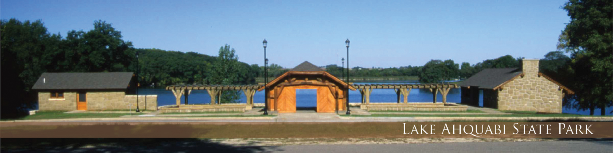
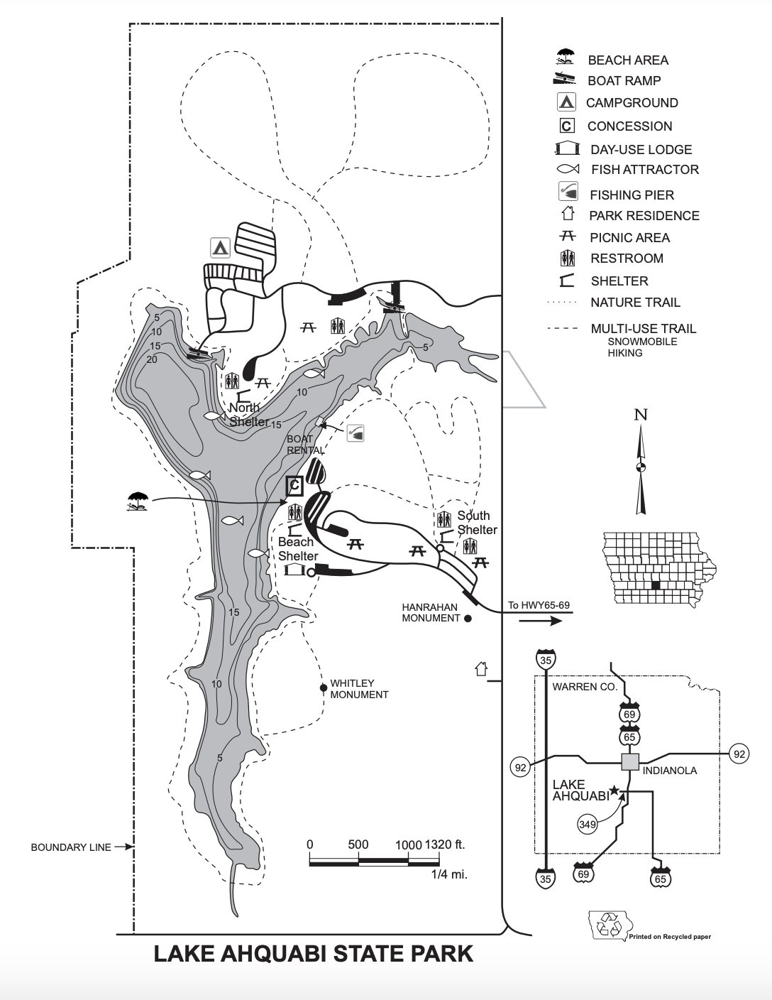

Lake Ahquabi
============

.. warning::
	Lake Ahquabi and the surrounding park will be closed beginning August 9, 2021 due to renovation. The water levels of the lake will be very low during this time.

**Lake Ahquabi** is a state park located near Indianola, Iowa. The word "ahquabi" originates from the Native American tribes *Sauk* and *Fox* and means "resting place". The park was dedicated to political cartoonist and conservationist J.N. "Ding" Darling in 1936. 

The park in total is about 770 acres and is located about 6 miles from Indianola.

	Iowa Department of Natural Resources [#f1]_

Map
---

Facilities & Campsites
----------------------
Many of the facilities or other man-made structures were built in the era of the Great Depression (1930s) by the Civilian Conservation Corps. There are three open shelters that are open to the public for picnics and are able to be reserved for large gatherings. 

There is also the stone lodge that has a great view of the lake. It is a popular rental place for reunions, weddings, and graduation parties. 

There is one campground that contains a number of smaller campsites within. The campground is located close to the shore of Lake Ahquabi. Near the campsites are electrical hookup stations, up-to-date restrooms (and showers), along with two dump stations for trailers and campers. Each designated campsite contains a firepit/fireplace and a picnic table. There is a playground located close by for the children to play on.

Any facilites can be rented through the `park reservation system <https://iowastateparks.reserveamerica.com//>`_ or through `Iowa State Parks website <https://iowastateparks.reserveamerica.com/camping/lake-ahquabi-state-park/r/campgroundDetails.do?contractCode=IA&parkId=610149/>`_.

Ahquabi Activities
------------------

On Land
^^^^^^^
Hiking or riding on **trails** is the most popular land-based activity in the park. There is a large looped trail around the lake that is approximately 4 miles. There are other, smaller trails that make up another 2 or so miles, all of the paths are gravel or rough dirt. Hikers and mountain bikers are very fond of these trails and can often be seen traveling them. The trails can be seen on the map above.

Due to the immense amounts of wildlife found in the park, **bird watching** is a common occurence, especially with the elder folk. There are other **wildlife viewing** services and pamphlets as well. Within one mile from Lake Ahquabi is a nature center.

In Water
^^^^^^^^
The lake has a large sandy beach, making it perfect for a lounge day on the sand or a dip in the lake. **Swimming** is a very popular activity at Lake Ahquabi, especially with families and young adults. The beach and lake is unsupervised, meaning there are no lifeguards on watch, so swim at your own risk.

.. note::
	The boat speed is **no-wake** while on the water.

There are two **boat** ramps in the Ahquabi State Park's territory: one is located on the northern end and one is by the campground. If you do not have your own boat, you can rent one from the concessionaire, which is located near the beach. Other items you can rent include:

* canoes
* kayaks
* paddleboats

Snacks are also readily available through the concessionaire, along with fish bait and firewood. **Fishing** is rather common at this lake, especially with anglers. The lake has many fishing jetties to use and an easily-accessible fishing pier. There is also a fish-cleaning station open for use.

Wildlife
--------
Lake Ahquabi and the surrounding reserve are full of foliage and fauna alike. There are herds of whitetail deer, along with a variety of birds (including the state bird, the goldfinch!). In and around the lake, chirping frogs can be seen and heard. 

The lake has an abundance of fish, and fishing is a popular activity to partake in. These fish are present within the waters:

+-----------------+------------------+-------------+
| Type of Fish    | Fishing Season   | Daily Limit | 
+=================+==================+=============+
| Black Crappie   | continuous       | 25          |
+-----------------+------------------+-------------+
| Bluegill        | continuous       | 25          | 
+-----------------+------------------+-------------+
| Channel Catfish | continuous       | 30          |
+-----------------+------------------+-------------+
| Largemouth Bass | continuous       | 3           |
+-----------------+------------------+-------------+
| Redear Sunfish  | continuous	     | N/A         |
+-----------------+------------------+-------------+

To read more about the fishing regulations in this lake, go to the Iowa Department of Natural Resources' website located `here <https://www.iowadnr.gov/Fishing/Where-to-Fish/Lakes-Ponds-Reservoirs/LakeDetails/lakeCode/AHQ91/>`_. 

.. rubric:: Footnotes:

.. [#f1] Iowa Department of Natural Resources. `<https://www.iowadnr.gov/Places-to-Go/State-Parks/Iowa-State-Parks/ParkDetails/ParkID/610149/>`_. Retrieved 2020-12-01.