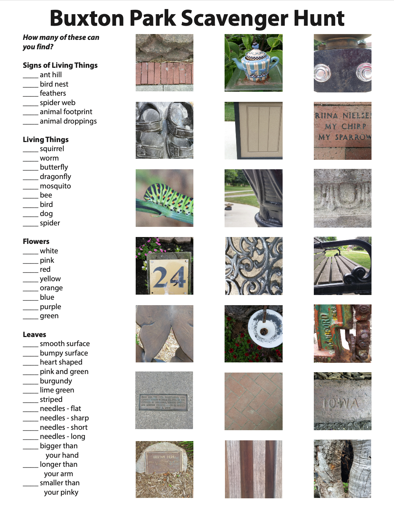

Buxton Park 
===========

The beautiful and flourishing **Buxton Park** is located on Simpson College's campus and is in the heart of Indianola. It is a popular spot for dog-walkers, joggers, and even a family (or solo!) leisurely stroll. Occassionally, photography sessions and weddings can be held amongst the colorful gardens. 

A part of the park was donated to the city of Indianola by the Buxton family, hence the park's name, in 1906. This was the city's first public park.

Map
---

.. image:: buxtonmap.png
	:height: 700px
	:scale: 50%
	:align: center

Arboretum
---------
There are around 25 different species of trees that are planted in Buxton Park. In accordance with the map above, the numbers in red circles are the type of tree found in park.

+----+----------------------+----------------+
|#   | Tree Species         | Main Color     |
+====+======================+================+
|1   | Saucer Magnolia      | white, purple  |
+----+----------------------+----------------+
|2   | Pacific Sunset Maple | orange, red    |
+----+----------------------+----------------+
|3   | Ginkgo               | green, yellow  |
+----+----------------------+----------------+
|4   | Kousa Dogwood        | white          |
+----+----------------------+----------------+
|5   | Royal Frost Birch    | red            |
+----+----------------------+----------------+
|6   | Gold Rush Dawn       | gold,          |
|    | Redwood              | chartreuse     |
+----+----------------------+----------------+
|7   | Japanese Tree Lilac  | cream          |
+----+----------------------+----------------+
|8   | Magnolia Butterflies | yellow         |
+----+----------------------+----------------+
|9   | Magnolia Leonard     | purple, pink,  |
|    | Messel               | white          |
+----+----------------------+----------------+
|10  | Pagoda Dogwood       | white, green   |
+----+----------------------+----------------+
|11  | Serviceberry         | white, blue-   |
|    |                      | green          |
+----+----------------------+----------------+
|12  | Tulip Tree           | pale green,    |
|    |                      | orange         |
+----+----------------------+----------------+
|13  | Yellowwood           | white, green   |
+----+----------------------+----------------+
|14  | Colorado Blue Spruce | blue- green    |
+----+----------------------+----------------+
|15  | Purple Beech         | purple, copper |
+----+----------------------+----------------+
|16  | Red Spruce           | green          |
+----+----------------------+----------------+
|17  | Dawn Redwood         | pale green,    |
|    |                      | pale pink      |
+----+----------------------+----------------+
|18  | Eastern Hemlock      | green          |
+----+----------------------+----------------+
|19  | Sweet Gum            | shiny green    |
+----+----------------------+----------------+
|20  | Weeping Crab         | white, dark    |
|    |                      | green          |
+----+----------------------+----------------+
|21  | Tricolor Beech       | purple, rose,  |
|    |                      | green, white   |
+----+----------------------+----------------+
|22  | Redbud               | orange, peach, |
|    |                      | chartreuse     |
+----+----------------------+----------------+
|23  | Japanese Red Maple   | dark red,      |
|    |                      | scarlet        |
+----+----------------------+----------------+
|24  | Katsura              | red- violet,   |
|    |                      | blue- green    |
+----+----------------------+----------------+
|25  | Rusty Blackhaw       | dark green,    |
|    | Vibernum             | white          |
+----+----------------------+----------------+

Structures
----------
The park contains a variety of structures and pathways in addition to all the foliage. The **gazebo** is a popular place for weddings and as a resting place, since it has spaced-out benches around the interior. Near the gazebo are two formal displays of flowers: the *Formal Annual Display* and the *Formal Garden*. In the middle of the **Formal Annual Display** is a large and pretty fountain, named the **Memorial Fountain**. The fountain is surrounded by flowers, presumably to keep children and animals from playing in the fountain. 

Near the **Information Center**, which is close to the gazebo, there is a pathway through the *Rose Gardens* which will lead you to the **Memorial Garden**, a garden with shiny slabs engraved with names of those in memorium. Next to the garden is the **Butterfly Gardens**, a great place to see some butterflies in the springtime, especially monarchs and swallowtails.

On the other side of the park, there is a pathway called **Crabapple Mall**, a strip of trees and flowers that lead to two benches and wooden arbors. In addition, there is a recently-added playground called **The Children's Garden** for children to play in and explore. 

Park Scavenger Hunt
-------------------
The City of Indianola has a scavenger hunt sheet for anyone who would like it, although it is namely used for children to explore nature.

