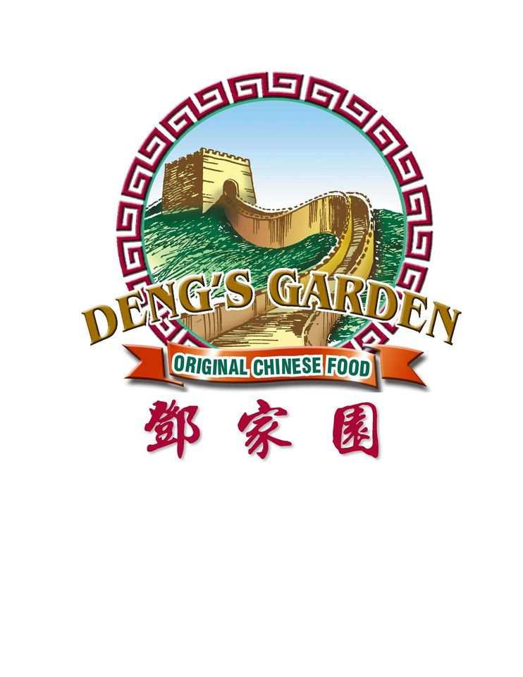

Deng's Garden
=============

**Dengs Garden is a local traditonal Chinease Restraunt servicing all Indianola residents.**

*They have come from the homeland of China to introduce Indianola to authentic Chinease Food.*

*The quality of food they produce and the prices they offer is unmatched in this town.*

*For Simpson students the walk from campus is only 10 minutes.*

*A meal here is the same price as a meal from Sub Connection!*

Hours & Contact
---------------
+--------------------+------------------+
|Address & Contacts  |Hours             |
+--------------------+------------------+
|312 N. Jefferson Way|Sunday - Monday   |
|                    |11:00am - 8:00pm  |
|Indianola, IA 50125 |                  |                      
+--------------------+------------------+
|515-962-5888        |Covid May Effect  |
|                    |Hours             |
+--------------------+------------------+