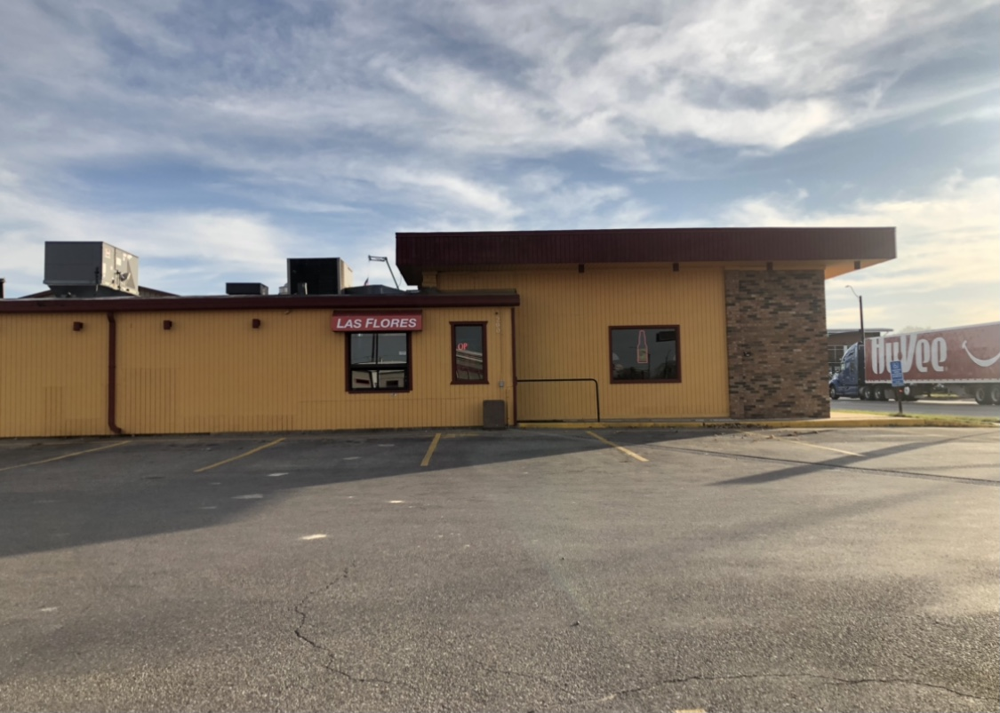

Las Flores Mexican Restaurant 
=============================

*Las Flores* is located on 200 S Jefferson Way, Indianola, Iowa. This is the 
perfect spot to enjoy a laid-back dinner with friends or family. They 
debatably have the best chips and queso in town. The building is decorated 
with cultural Mexican decoration. There is a lot to look at while waiting for
your meal to arrive. No need to worry about COVID-19 restrictions wither, they
offer takeout. Las Flores is within walking distance of Simpson College’s 
campus, this would be the perfect spot to grab a bite to eat with some friends. 
Las Flores in open 11AM-10PM every day except for Sunday, when they close at 
9PM. Las Flores in right down the street from La Casa, another Mexican 
restaurant in town. They are both always very busy, so it is hard to say 
which restaurant has the better food. 

Menu
----
**Las Flores** has seafood options which include shrimp burritos and fish tacos. 
hey also have a long list of burrito options. Options like the Burrito Bandera,
Burrito Arandas and Burrito Rio Grande are so big that one burrito takes up 
the whole plate. The menu also includes taco salads and fajita salads. 
Finally, they have six different fajita options that are served on a cast
iron skillet. They also offer seven types of quesadillas. 

Quesadilla fillings
+++++++++++++++++++
    1. *Beans* 
    2. *Cheese* 
    3. *Beef tips* 
    4. *Chicken* 
    5. *Steak* 
    6. *Shrimp*
    7. *Sausage*

Job Opportunities
-----------------
On October 2, Las Flores posted to there Facebook page looking to hire new 
servers. This would be a great opportunity for any Simpson College student 
looking for work. The restaurant is within walking distance of campus and 
would be a fun, upbeat place to work. 

.. note::
   *COVID-19 restrictions may apply.*

