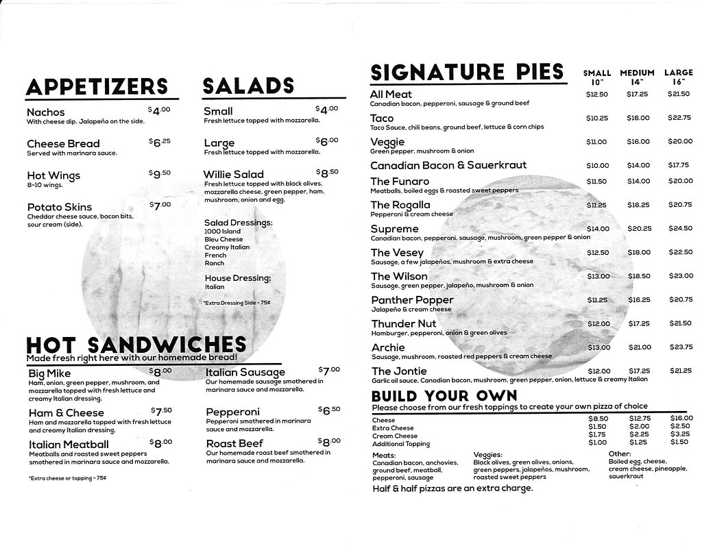

Pete's Pizza
============
A local hole in the wall pizza dive bar, located on the town square. 
This is a great place for a quick slice with the family or grabbing a 
beer with your friends! We have a variety of pizza, which are fantastic 
and made from scratch every day.  

Pete’s has been around for many years and we pride ourselves on our 
relationship with our customers! We have an arcade room for all ages, 
TV’s to watch the game, and high-top bar in the middle of the restaurant! 
It is a very fun environment for all!

Menu [f1]_

Hours
-----

+---------+--------+
|Monday	  |Closed  |
+---------+--------+
|Tuesday  |Closed  |
+---------+--------+
|Wednesday|4:30–9PM|
+---------+--------+
|Thursday |4:30–9PM|
+---------+--------+
|Friday   |4–10PM  |
+---------+--------+
|Saturday |4–10PM  |
+---------+--------+
|Sunday   |Closed  |
+---------+--------+

.. warning::
    At this time, we are only able to accept cash or check, sorry for 
    the inconvenience.

**Address:**
    118 N Howard St #2510, Indianola, IA 50125

**Phone:**
    515-961-7797

.. [f1] "`Menu <https://www.tripadvisor.com/Restaurant_Review-g38017-d415460-Reviews-Pete_s_Pizza-Indianola_Iowa.html#photos;aggregationId=&albumid=101&filter=7&ff=415213626>`_". Trip advisor. 2006. Retrieved 2020-12-02.
