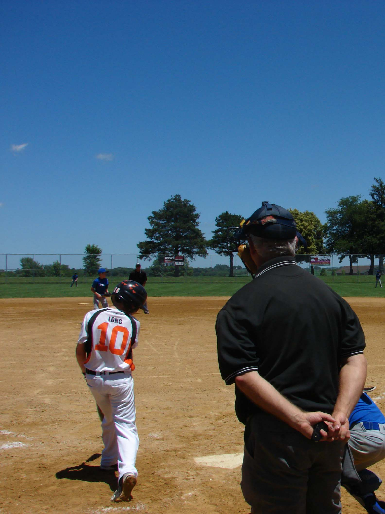

Pickard Sports Complex
======================

**Indianola's Pickard Sports Complex** is the largest park in Indianola. It hosts many youth and adult sporting events such as:

1. :ref:`Fastpitch softball<Ballfields>`
2. :ref:`Slowpitch softball<Ballfields>`
3. :ref:`Baseball <Ballfields>`
4. :ref:`Cross country meets <Crosscountry>`
5. :ref:`Disc Golf Tournaments <Discgolf>`

Electricity, water and restrooms are available between April 15 - October 15.

+----------------+-----------------------+
| Information    |                       |
+================+=======================+
| Location       | | Pickard Park        |
|                | | 2205 E 2nd Ave      |
|                | | Indianola, IA, 50125|
+----------------+-----------------------+
| Phone          | 515-961-9420          |
+----------------+-----------------------+
| Max Capacity   | 150                   |
+----------------+-----------------------+

+--------------------+------------------+
| Hours of Operation | (Default)        |
+====================+==================+
| Sunday-Monday      | 6am - 10pm       |
+--------------------+------------------+

History
-------
The Clarence Pickard family bought the land in 1976. It was originally a farm that was transformed into the park it is today. The man-made hillsides was done by the Soil Conversation Service in Warren Country. Pickard park is known to have some of the first terrances and water diversion projects that were completed. 

Features
^^^^^^^^
* Playground that is ADA accessible
* Drinking fountains
* Grill
* Horseshoe court
* Modern restrooms
* Pinic shelters

Sports
------

.. _Ballfields:

Softball & Baseball
^^^^^^^^^^^^^^^^^^^

At **Pickard Park**, there are four adult softball fields and two youth softball fields available. All of these fields can be used as a baseball field, as the park has removable pitching mounds.

   Baseball Game [#f2]_ 

The **Indianola Park and Rec Youth and Adult Softball Teams** reserve the fields for practice times at coach and manager meetings. Any **Independent Competitive Softball and Baseball Teams** can equally reserve practice time after the Parks and Rec teams reserve their times. Usually there is a meeting to sort out the feild times and reservations. This can happen between April and June and, again, between July and September. 

However, there are qualifications to reserve the fields:

* 75% of team must attend Indianola Schools
* Must submit a rost with names and info of all the coaches and players
* Pay in advance for reservations
	* $10 per 75-minute practice time

If the **Indianola Little League Baseball Teams** or anyone else wants to reserve a field, they must call one week in advance and the fee must be paid at that time

.. _Crosscountry:

Cross Country
^^^^^^^^^^^^^

**Pickard Park** has a one-mile Terrace Trail and a two-mile Pond & Prairie trail, mowed and marked trail loops that starts near the shelter. These loops and land is very commonly used for Cross Country meets hosted by Indianola Schools and Simpson College. The **McVay Trail** is a 1.6 mile paved route that can take you to **Pickard Park**.

.. _Discgolf:

Disc Golf
^^^^^^^^^

.. figure:: pickard_map.png
   :height: 1800px
   :width: 1700px
   :scale: 30%
   :alt: alternate text
   :align: center

   Disc Golf Course [#f1]_ 

There is an 18-hole disc golf course located east of the **Pickard Park** shelter. It is free to play. You can find scorecards at the information kiosk near the course.

`Learn how to play disc golf <https://www.instructables.com/How-to-Play-Disc-Golf/>`_.

Campground
----------

.. warning:: TEMPORARLY CLOSED (12/2/2020)

.. attention:: 
	2020 COVID UPDATE

	- Only self-contained units are allowed 
	- No guests allowed; only campers 
	- Only family units allowed in each campsite 
	- No groups larger than 10 
	- Social distance 
	- Stay at home if you've been sick in the past two weeks
	- Avoid popular areas 

Regulations
^^^^^^^^^^^

1. No open fires
2. All animals must be on a leash (max 15 feet)
3. 10mph speed limit
4. Be quiet
5. Need to be registered to be permitted in the area after 11pm
6. No dumping gray water on ground
7. No damaging of park property

Pay & Stay
^^^^^^^^^^

There are 10 spaces available for self-contained units only. Not all areas are shaded. The campground does not have restrooms, a dump station, or a sewer. 

Campground spots cannot be reserved, as there are available on a first-come, first-served basis. You can pay the $12 per day free by self-registration at the pay post.

.. rubric:: Footnotes

.. [#f1] Disc Golf Course <http://www.indianolaiowa.gov/Facilities/Facility/Details/-28>`_". City of Indianola. Retrieved 2020-12-02.
.. [#f2] Baseball Game <http://www.indianolaiowa.gov/Facilities/Facility/Details/-12>`_". City of Indianola. Retrieved 2020-12-02.

