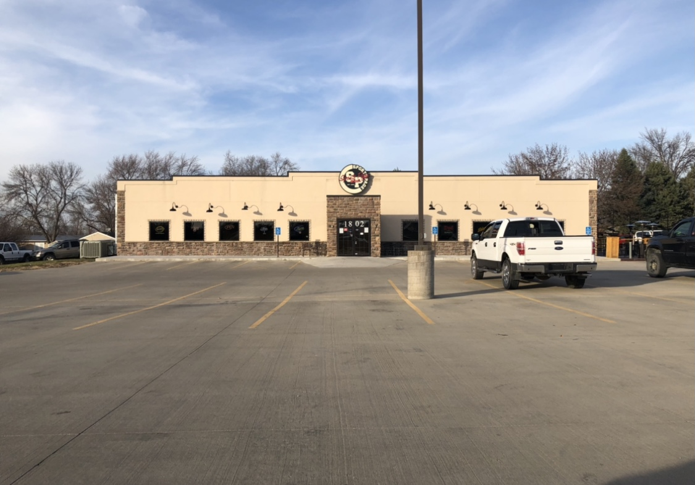

Sports Page Bar and Grill 
=========================

   Sports Page Bar and Grill [#f1]_

*Sports Pages Bar and Grill* is located at 1802 W 2nd Ave, Indianola, Iowa. 
If you are looking for a fun place to watch the game this is the place for you.
Sports Page Bar and Grill has about 20 high-definition TV’s for customers to
watch their favorite teams while enjoying delicious food and drinks. 
Sports Page bar and Grill is clearly a hot spot for the people of Warren County. 
You don’t have to go there yourself to find this out either. The parking lot is 
always packed full on game days and weekends. Not only can you go there to watch 
your favorite team, they also bring in live music for customers’ enjoyment. 
Live music is the perfect attraction for those who don’t really like sports as 
much. 

Menu 
--------

**Sports Page Bar and Grill** has been voted for best burger of 
Warren County many times. They offer much more than just burgers 
though. You can order almost anything you can think of including 
wings, pasta, steaks, wraps and much more! Sports Page Bar and 
Grill also has a full bar with a large number of options. They also 
have local Iowa Craft beers. The bar has every Iowans favorite beer, 
Busch Light in bottles and can. They also have Bud Light and many 
other beers. Sports Page Bar and Grill has a huge menu with an option 
for everyone and the prices are very reasonable. You can start out 
your meal with appetizers like their layered nachos which include 
layers of meat, queso cheese, shredded cheese, chips and more. 
They also have an Iowan favorite, fried pickle that come with a side of
homemade ranch. They have fourteen different burgers to choose from 
along with wings and chicken-based dishes. For the kids, they have the 
‘Minor League’ menu featuring mac and cheese, hamburgers, chicken 
strips and more. For more menu items, `click here`_.  

Reviews
-----------

The Sports Page bar and Grill is full of good reviews from customers.
The restaurant received a 3.8 out of 5 stars. Most of the reviews 
include personal stories from customers’ time spent in the 
establishment. Many customers rave about great service and even 
better food and atmosphere. 

Job Opportunities
-----------------------

Sports Page Bar and Grill would be a great opportunity for any Simpson 
student to have a fun job. In the past, students have worked here and 
really enjoyed the atmosphere. Sports Page is a great way to meet new 
and fun people while also making some extra cash. 

Sports Page Hours
-----------------

+------------+------------+----------+
| Mon-Thurs  | Fri& Sat   | Sun      |
+============+============+==========+
| 11AM-10PM  |11AM-10:30PM| 11AM-9PM |
+------------+------------+----------+

.. note::
   **COVID-19 restrictions may apply.**

.. [#f1] "`Sports Page Bar and Grill Sports Page [Personal photograph taken in Sports Page Bar and Grill, Indianola, IA]. (2020, November 18)..
.. _click here: https://thesportspagegrill.com/pdf/2018/Sports-Page-Menu-2018-NEW.pdf

